# State Machine Diagram

The `matching_agent.py` workflow follows the PDF brief:

```mermaid
flowchart LR
    START([START]) --> ParseJD["Parse JD"]
    ParseJD --> ExtractRequirements["Extract Requirements"]
    ExtractRequirements --> SearchResumes["Search Resumes"]
    SearchResumes --> InitialScreen["Initial Screen: Top 10"]
    InitialScreen --> DeepAnalysis["Second Round: Deep Analysis"]
    DeepAnalysis --> RankCandidates["Final Rank + Hire/No-Hire"]
    RankCandidates --> GenerateReport["Generate Report"]
    GenerateReport --> HumanFeedback["Human Feedback Loop"]
    HumanFeedback --> END([END])
```

## State Tracked

- `conversation_history`: user requests and follow-up refinements
- `job_description`: current job description or search request
- `requirements`: parsed must-have skills, nice-to-have skills, years, and keywords
- `all_candidates`: resumes retrieved by local RAG-style search
- `initial_screen`: top 10 retrieved candidates
- `second_round`: deeper analysis of top 10 candidates
- `final_recommendations`: top 5 hire/maybe/no-hire recommendations
- `shortlist`: ranked candidates with strengths, gaps, scores, and recommendations
- `report`: detailed match report
- `feedback`: user refinement used for re-ranking

## Tool Coverage

- Milestone 1 file tools: `read_file`, `list_files`, `write_file`, `search_in_file`
- RAG search tool: `rag_search_resumes`
- Extra tools: `extract_requirements`, `compare_candidates`, `generate_interview_questions`
